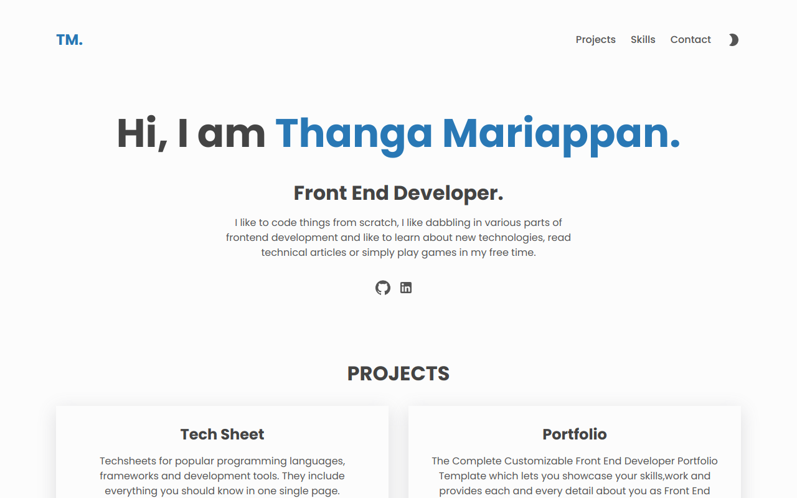

## Portfolio

<div align="center">
  
</div>
<center>

[](https://forthebadge.com) &nbsp;
[](https://forthebadge.com) &nbsp;
[](https://forthebadge.com) &nbsp;

</center>

## Built With


This project was built using these technologies.

- React
- Dark mode support
- VsCode
- Vercel

## Features

**🌙 Dark Mode**

**📃 Markdown Support**

**✏️ Easy to customize and write portfolio of your own**


## Getting Started

### 🛠 Installation and Setup Instructions

To get started just clone this repository. You will need `node.js` and `git` installed globally on your machine.

Run

```
npm install
```

```
npm run start
```

Open [http://localhost:3000](http://localhost:3000) with your browser to see the result.


### Show your support

Give a ⭐ if you like this website!

<a href="https://www.buymeacoffee.com/thanga" target="_blank"></a>